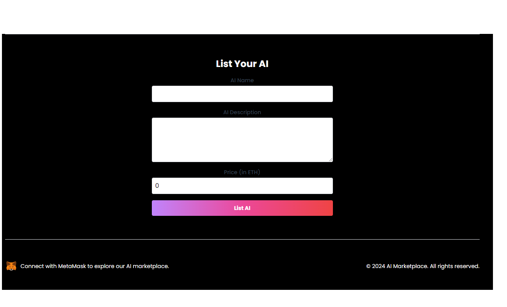

# AIMarketPlace

Welcome to the AI Marketplace! This platform allows users to list, purchase, and rate AI models seamlessly. 

## Table of Contents

- [Features](#features)
- [Technologies Used](#technologies-used)
- [Installation](#installation)
- [License](#license)

## Features

- **User Registration and Authentication:** Users can create accounts and log in securely with metamask.
- **Listing AI Models:** Users can list their AI models with detailed descriptions and pricing.
- **Purchasing Models:** Users can purchase AI models with Ethereum transactions.
- **Rating System:** Users can rate models from 0 to 5.

## Screenshots 

**Marketplace:** 


**List submission Form:** 



## Technologies Used

- **Frontend:** React, Tailwind CSS
- **Blockchain:** Solidity, Ethereum Smart Contracts, Ethereum (Holesky  network)

## Installation

1. Clone the repository:
   ```bash
   git clone https://github.com/heyoSSam/AIMarketPlace
   
2. Navigate to the front/smartcontracts directory:

   cd front

   cd smartcontracts

4. Install dependencies:

   npm install

Make sure you have Hardhat installed.

5. Start the frontend:

   npm run dev

## License
This project is licensed under the MIT License. See the LICENSE file for more details.
